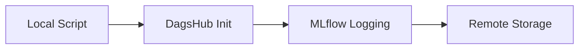

```markdown
# Iris Classification with DagsHub + MLflow Tracking  

This project demonstrates model tracking for the Iris dataset classification task using **DagsHub** as a remote MLflow server. It highlights key concepts, practical implementation details, and lessons learned for experiment tracking and reproducibility.  

---

## 🔑 Key Concepts  

### 1. **DagsHub-MLflow Integration**  
Connect your local script to DagsHub for remote experiment tracking.  

```python
import dagshub
dagshub.init(repo_owner='bpratik01', repo_name='IRIS_REMOTE_SERVER', mlflow=True)
mlflow.set_tracking_uri('https://dagshub.com/bpratik01/IRIS_REMOTE_SERVER.mlflow')
```

- `dagshub.init()`: Initializes the connection to the DagsHub repository.  
- `mlflow.set_tracking_uri()`: Directs MLflow to log all experiments remotely.  
- **Note**: Ensure you authenticate with DagsHub via CLI or access token.  

---

### 2. **Experiment Organization**  
Organize experiments and runs effectively for clarity and reproducibility.  

```python
mlflow.set_experiment('iris-dt')
with mlflow.start_run(run_name='detree_iris_md=5'):
```

- `set_experiment()`: Groups related runs under a named experiment.  
- `start_run()`: Begins a new run and ensures proper logging and cleanup.  
- **Pro Tip**: Use meaningful names for experiments and runs.  

---

### 3. **Comprehensive Logging**  
Log parameters, metrics, artifacts, and models for complete traceability.  

```python
# Parameters & Metrics
mlflow.log_param('max_depth', max_depth)
mlflow.log_metric('accuracy', accuracy)

# Artifacts
mlflow.log_artifact('confusion_matrix.png', 'images')
mlflow.log_artifact('iris_dt.py')

# Model Packaging
mlflow.sklearn.log_model(model, 'model')
```

- **Parameters**: Log hyperparameters (e.g., `max_depth`).  
- **Metrics**: Record performance metrics (e.g., `accuracy`).  
- **Artifacts**: Save supporting files (e.g., visualizations, scripts).  
- **Models**: Save the trained model for reproducibility and deployment.  

---

### 4. **Visualization Logging**  
Generate and log plots for better insights into model performance.  

```python
# Confusion Matrix Plot
sns.heatmap(cm, annot=True, fmt='d', cmap='Blues', 
            xticklabels=data.target_names, 
            yticklabels=data.target_names)
plt.savefig('confusion_matrix.png')
```

- Include visual explanations (e.g., confusion matrix) for classification tasks.  
- **Tip**: Visualizations are logged as artifacts and displayed in the DagsHub UI.  

---

## 📂 Directory Structure  

```plaintext
├── iris_dt.py            # Main training script
├── confusion_matrix.png  # Auto-generated plot
└── mlruns/               # Local tracking (disabled in this setup)
```

---

## 📋 Dependencies  

Install the required packages to run the project:  

```bash
pip install dagshub mlflow scikit-learn seaborn
```

---

## 🌐 Viewing Results  

Access the experiment logs and artifacts at:  
[https://dagshub.com/bpratik01/IRIS_REMOTE_SERVER.mlflow](https://dagshub.com/bpratik01/IRIS_REMOTE_SERVER.mlflow)  

---

## ⚠️ Common Pitfalls  

1. Forgetting to call `dagshub.init()` before setting the tracking URI.  
2. Incorrect or missing file paths for logging artifacts.  
3. Version mismatches between local Python environment and the model's dependencies.  

---

## 📈 Key Learnings  

### 1. **Remote Tracking Benefits**  
- Centralized storage for experiments and artifacts.  
- Enhanced team collaboration with version control.  
- Improved reproducibility for experiments and models.  

### 2. **MLflow-DagsHub Workflow**  


### 3. **Reproducibility Essentials**  
- Parameters enable precise experiment replication.  
- Serialized models simplify redeployment.  
- Artifacts provide context for insights and decisions.  

```python
# To load a logged model later:
loaded_model = mlflow.sklearn.load_model('runs:/<RUN_ID>/model')
```
